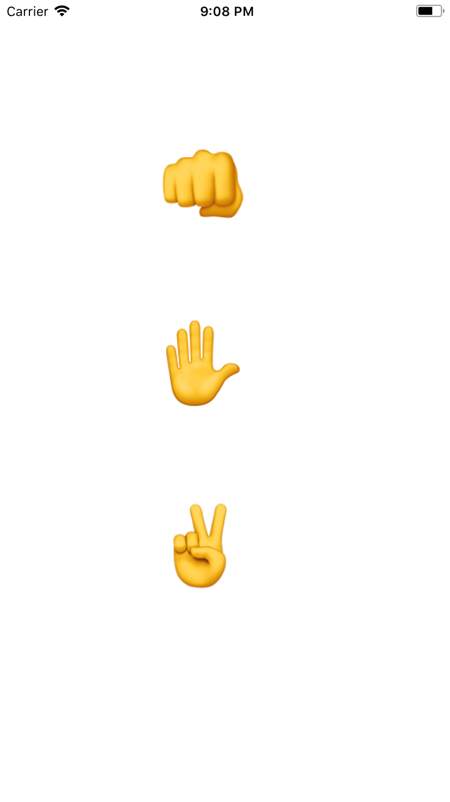
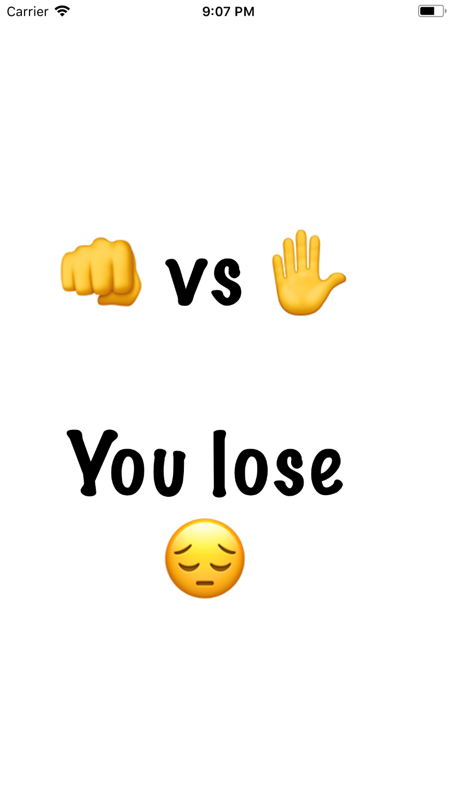

# Rock Paper Scissors
An application that demonstrates segues(programmatically), outlet collections, enumerations, and passing data to other view controllers

 

## Requirements
- [x] The first (initial) view controller should contain three buttons: rock, paper, and scissors.  
     Once a button is clicked, the first view controller should modally present the second view controller.
     
- [x] The second view controller should randomly select a move and display the results of the match.  
     The description of the results should be a form like “Rock vs. Paper.  You lose!” or “Rock vs. Rock. Tie.”  
     This result can be displayed in a label.  You can add images if you want to, but it is not required.
     
- [x] Create an enum to formalize the three possible moves called RPSMove

- [x] Create a class RPSGame that contains
   - [x] a property called 'playerMove' of type RPSMove
   - [x] a method called 'gameResult' that has a return type of String that gives the results of the game

